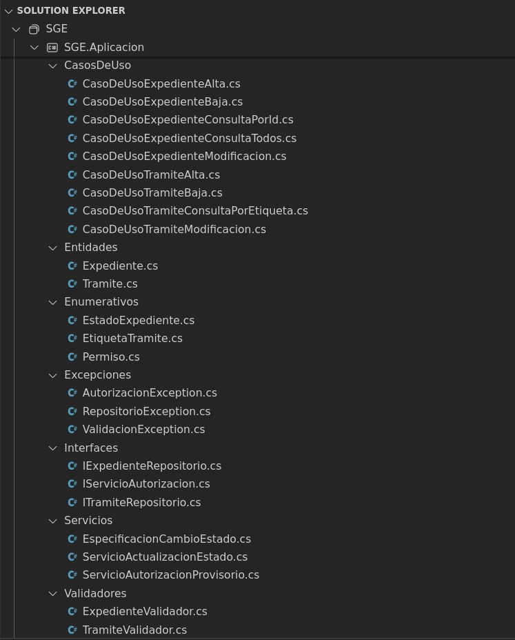

# SISTEMA PARA LA GESTIÓN DE EXPEDIENTES

## Descripción general

El objetivo es desarrollar un sistema de gestión de expedientes que posibilite la organización y administración efectiva de la información. Cada expediente contendrá un conjunto de datos propios, junto con una colección de trámites asociados.

### Entidades

Se trabajará con dos entidades fundamentales: **Expediente** y **Trámite**. Ambos elementos serán gestionados y persistidos de forma independiente, siguiendo el patrón de repositorios e inyección de dependencias visto en la teoría 7 de este curso.

Cada expediente y trámite estará caracterizado por una propiedad Id única, lo que facilitará su identificación entre otras instancias del mismo tipo. Para mantener la separación en la persistencia de expedientes y trámites, será esencial establecer una relación que permita determinar qué trámites pertenecen a qué expedientes. A tal efecto, se empleará una propiedad denominada **ExpedienteId** en la clase **Trámite**, destinada a asociar un trámite a un expediente específico.

Los atributos que definirán un expediente comprenderán:
- El Id del trámite, un identificador numérico único
- La carátula, texto ingresado por el usuario
- La fecha y hora de creación
- La fecha y hora de la última modificación
- El usuario que realizó la última modificación, identificado por su Id de usuario
- El estado del expediente.

Por otro lado, cada trámite agregado a un expediente estará compuesto por los siguientes datos:
- El Id del trámite, identificador numérico único entre todos los trámites gestionados por el sistema
- El Id del expediente al que pertenece, propiedad **ExpedienteId** mencionada previamente
- La etiqueta que identifica el tipo de trámite
- El contenido específico del trámite, texto ingresado por el usuario
- La fecha y hora de creación del trámite
- La fecha y hora de la última modificación del trámite
- El usuario que realizó la última modificación, identificado por su Id de usuario.

Los valores posibles para establecer el estado de un expediente son los siguientes:
- Recién iniciado
- Para resolver
- Con resolución
- En notificación
- Finalizado

Los valores posibles para establecer la etiqueta de un trámite son los siguientes:
- Escrito presentado
- Pase a estudio
- Despacho
- Resolución
- Notificación
- Pase al Archivo

Se asume, por simplicidad, que estos estados y etiquetas son fijos y no requerirán modificaciones, por lo que se pueden codificar en un tipo enumerativo.

### Permisos de usuario

El sistema también gestiona usuarios y sus respectivos permisos. Esto se debe a la necesidad de que los usuarios cuenten con los permisos adecuados para llevar a cabo las operaciones requeridas. Aunque la administración de usuarios (alta, baja y modificación) se pospondrá para la próxima entrega, es importante destacar que todas las operaciones relacionadas con las entidades **Trámite** y **Expediente** deben llevar consigo la información del Id de usuario que las está ejecutando.

Todos los usuarios tendrán acceso de lectura sobre ambas entidades (**Expediente** y **Trámite**). No obstante, para realizar altas, bajas o modificaciones será necesario contar con permisos explícitos. Cada usuario podrá poseer varios de los permisos que se detallan a continuación:

- ExpedienteAlta: Puede realizar altas de expedientes
- ExpedienteBaja: Puede realizar bajas de expedientes
- ExpedienteModificacion: Puede realizar modificaciones de expedientes
- TramiteAlta: Puede realizar altas de trámites
- TramiteBaja: Puede realizar bajas de trámites
- TramiteModificacion: Puede realizar modificaciones de trámites

A modo de ejemplo, un usuario podría tener permiso para eliminar trámites sin tenerlo para eliminar expedientes. Sin embargo, se asume que aquellos usuarios con permisos para eliminar expedientes también tendrán la capacidad para eliminar trámites. La razón es que al dar de baja un expediente, se deben eliminar también todos los trámites asociados.

### Validaciones

Además, el sistema debe realizar validaciones para evitar el ingreso de expedientes o trámites que no cumplan con ciertos requisitos. Estos requisitos son los siguientes:
- La carátula de un expediente no puede estar vacía
- El contenido de un trámite no puede estar vacío
- El id de usuario (en trámites y expedientes) debe ser un id válido (entero mayor que 0)

### Cambio automático del estado de un expediente

El sistema también debe gestionar ciertos desencadenantes que se activan al manipular los trámites de los expedientes, lo que ocasionará un cambio automático en el estado del expediente. Al agregar un trámite a un expediente, dependiendo de la etiqueta de dicho trámite, puede ser necesario realizar un cambio de estado automático en el expediente asociado.

Los trámites que provocan un cambio automático en el estado del expediente son los siguientes:
- Cuando la etiqueta del último trámite es "Resolución", se produce un cambio automático al estado "Con resolución".
- Cuando la etiqueta del último trámite es "Pase a estudio", se produce un cambio automático al estado "Para resolver".
- Cuando la etiqueta del último trámite es "Pase al Archivo", se produce un cambio automático al estado "Finalizado".

Este cambio automático del estado del expediente también debe llevarse a cabo al eliminar un trámite. Si como resultado de esta eliminación, el último trámite restante es uno de los mencionados anteriormente, que ocasiona un cambio automático de estado, dicho cambio también deberá realizarse automáticamente. Lo mismo ocurrirá si se modifica el último trámite, cambiando su etiqueta por otra que también desencadene un cambio automático en el estado del expediente.

### Manejo de excepciones

El sistema debe estar preparado para manejar al menos tres nuevas excepciones relacionadas con la autorización de usuarios, la validación de entidades y los repositorios.
- La excepción **AutorizacionException** debe ser lanzada cuando un usuario intenta realizar una operación para la cual no tiene los permisos necesarios.
- La excepción **ValidacionException** debe ser lanzada cuando una entidad no cumple con los requisitos exigidos y, por lo tanto, no supera la validación establecida.
- La excepción **RepositorioException** debe ser lanzada cuando la entidad que se intenta eliminar, modificar o acceder no existe en el repositorio correspondiente.

## Detalles de implementación

Codificar la solución llamada SGE (por Sistema de Gestión de Expedientes) con tres proyectos: SGE.Aplicacion, SGE.Repositorios y SGE.Consola, utilizando como modelo de arquitectura limpia el visto en la teoría 7 de este curso.

### Proyecto SGE.Aplicacion

En el proyecto **SGE.Aplicacion** codificar las 2 entidades mencionadas: **Expediente** y Tramite. Puede resultar de utilidad Invalidar el método ToString() en ambas entidades.

Para obtener un código desacoplado, implementar las validaciones de ambas entidades por medio de clases especializadas. Así, para validar la entidad Tramite definir una clase **TramiteValidador**. Para validar la entidad **Expediente** definir la clase **ExpedienteValidador**.

Codificar también en este proyecto los enumerativos **EstadoExpediente** y **EtiquetaTramite**. Estos enumerativos contendrán los valores que podrán asignarse a las propiedades Estado (de la entidad **Expediente**) y Etiqueta (de la entidad **Trámite**), respectivamente. Además, implementar el enumerativo **Permiso**, el cual incluirá los valores correspondientes a los permisos que el sistema debe manejar.

Codificar también en este proyecto un servicio de autorización para validar las credenciales del usuario al momento de realizar operaciones. El servicio debe implementar la siguiente interfaz:

```csharp
public interface IServicioAutorizacion
{
    bool PoseeElPermiso(int IdUsuario, Permiso permiso);
}
```

Para esta primera entrega, desarrollar un servicio de autorización provisional llamado ***ServicioAutorizacionProvisorio***, que implemente la interfaz **IServicioAutorizacion**. Este servicio siempre debe responder **true** cuando el **IdUsuario** sea igual a 1 y **false** en cualquier otro caso (no hace
falta realizar ninguna verificación). Utilizaremos este servicio provisional temporalmente hasta que la gestión completa de usuarios esté implementada en la próxima entrega. En ese momento, se reemplazará **ServicioAutorizacionProvisorio** por un servicio de autorización definitivo que verificará adecuadamente si el usuario tiene el permiso por el cual se está consultando.

Para acceder a los repositorios usaremos inversión de dependencia, por lo tanto, se deben definir en este proyecto las interfaces necesarias para trabajar con ellos.

Definir también en este proyecto las excepciones mencionadas anteriormente que serán lanzadas por los repositorios y por el servicio de autorización.

Codificar los casos de uso para realizar altas, bajas y modificaciones en las entidades **Expediente** y **Trámite**. Se debe tener en cuenta que las fechas de creación y modificación de estas entidades serán establecidas por el respectivo caso de uso, sobrescribiendo las fechas del objeto a persistir recibido como
parámetro. Además, es necesario destacar que, en el caso de las altas, corresponde a los repositorios, y no a los casos de uso, la responsabilidad de asignar el Id de las entidades, asegurándose de asignarlos de manera automática e incremental.

Las operaciones de eliminación, tanto de expedientes como de trámites, se llevarán a cabo utilizando el Id de la entidad que se desea eliminar y que se pasa como parámetro. Es importante destacar que al eliminar un expediente, se deben eliminar también todos los trámites asociados a dicho expediente.

Se debe garantizar que para las operaciones de alta, baja y modificación se verifique la autorización del usuario antes de proceder. Por lo tanto, el método Ejecutar de estos casos de uso deberá recibir también el Id del usuario como parámetro.

Además, se debe implementar un caso de uso que permita la consulta de un expediente junto con todos sus trámites, utilizando el Id del expediente como referencia.

Asimismo, se debe desarrollar un caso de uso para listar todos los expedientes (sin incluir sus trámites) y otro para listar todos los trámites en el sistema que posean una etiqueta específica. Por ejemplo, podríamos querer listar todos los trámites de tipo "Resolución" que existen en el sistema, independientemente del expediente al que pertenezcan.

Para llevar a cabo el cambio automático del estado de un expediente, se puede emplear la siguiente estrategia: desarrollar un servicio que, a partir del Id de un expediente, recupere la etiqueta de su último trámite. Basándose en esta información y conforme a las especificaciones detalladas en este documento, dicho servicio realizará el cambio de estado del expediente cuando sea necesario. Este servicio podrá ser invocado por los casos de uso correspondientes después de agregar, modificar o eliminar un trámite.

Además, resultaría beneficioso desacoplar el servicio de la especificación que define qué cambio de estado debe llevarse a cabo en función de la etiqueta del último trámite. Esta especificación podría ser suministrada al servicio mediante la técnica de inyección de dependencias.

De manera orientativa, la imagen siguiente muestra un posible conjunto de clases e interfaces definidas para implementar el proyecto SGE.Aplicacion.



### Proyecto SGE.Repositorios

En el proyecto SGE.Repositorios definir los repositorios provisorios para persistir las entidades. La persistencia en estos repositorios debe implementarse utilizando archivos de texto plano. En la próxima entrega reemplazaremos estos repositorios provisorios por otros definitivos que accedan a una base de datos SQLite. Respecto a las altas, es responsabilidad de los repositorios determinar el Id con el que se persistirán las entidades, asegurándose de que este sea incremental y garantizando su unicidad.

**Nota:** Para actualizar los datos en los archivos de texto no se deben tener en cuenta aspectos de rendimiento. Por ejemplo, se podría sobrescribir el archivo completo sólo para modificar un registro en el mismo. En la próxima entrega vamos a utilizar un manejador de bases de datos para gestionar la persistencia de manera más eficiente.

### Proyecto SGE.Consola

El proyecto Biblioteca.Consola se utilizará para interactuar con las otras partes de la solución y verificar el correcto comportamiento de las partes desarrolladas. En la próxima entrega vamos a crear una verdadera interfaz de usuario web utilizando Blazor.
